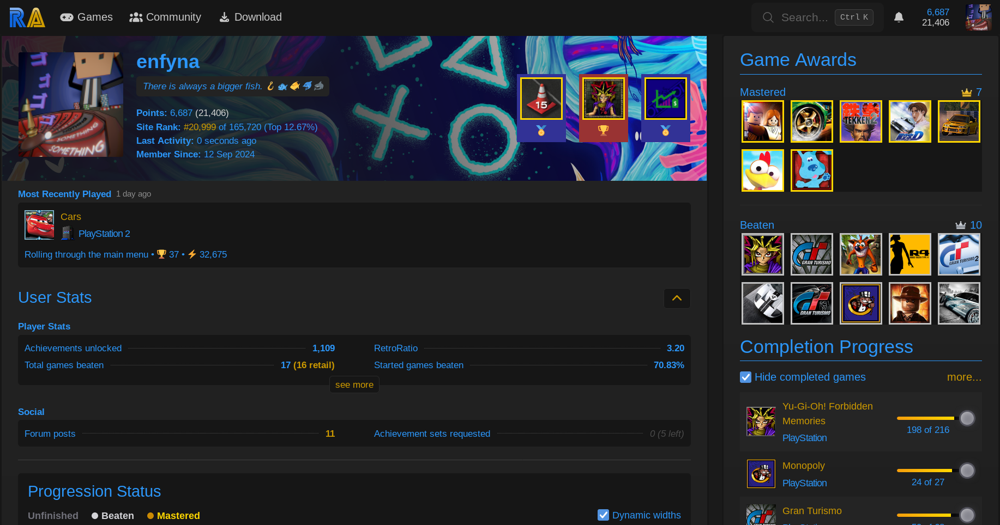
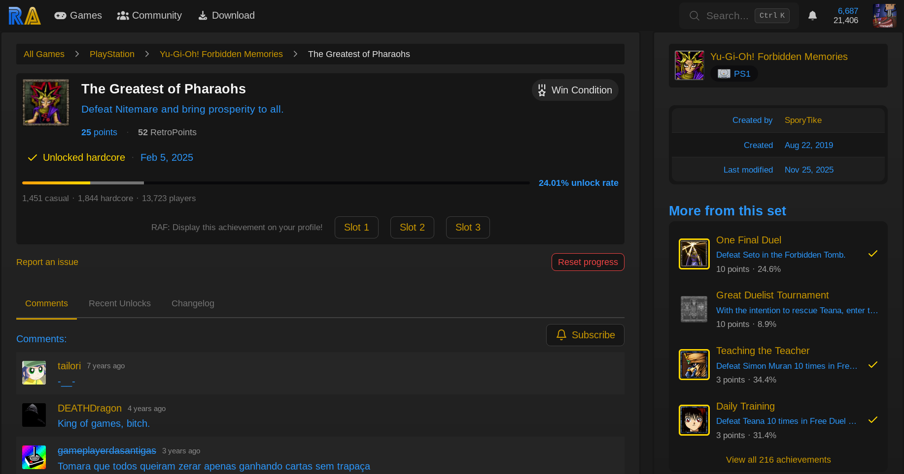

# RAF — RetroAchievements Favorite Achievements

Firefox extension that shows your 3 most favorite achievements on your profile banner.

user.js:

Banner image, achievement border color and emojis are customizable. 

achievement.js:

Go to the achievement page you want to display on your profile and select its slot using the buttons under the progress bar.
